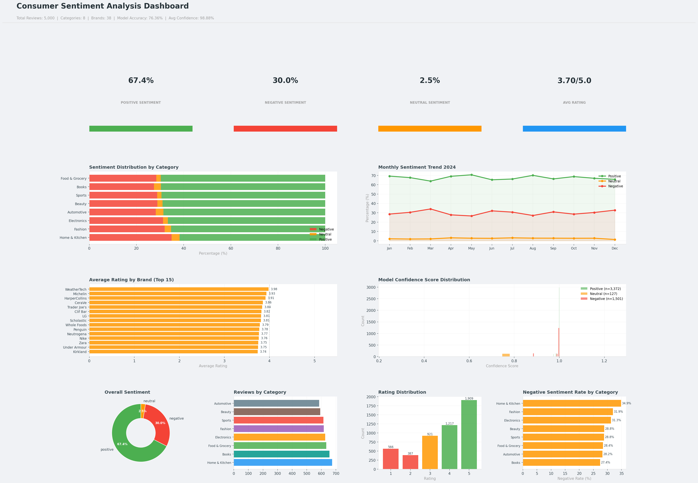

# Consumer Sentiment Analysis

An end-to-end NLP sentiment analysis project analyzing 5,000 consumer
reviews across 8 product categories using DistilBERT transformer model
with GPU-accelerated inference.

## Model Performance
- **Total Reviews Analyzed:** 5,000
- **Categories:** 8 (Electronics, Fashion, Home & Kitchen, Beauty, Sports, Automotive, Books, Food & Grocery)
- **Brands:** 38
- **Model:** DistilBERT (distilbert-base-uncased-finetuned-sst-2-english)
- **Model Accuracy:** 76.36%
- **Avg Confidence Score:** 98.88%
- **Date Range:** 2024-01-01 to 2024-12-31

## Dashboard Visualizations

## Dashboard Sections
1. **KPI Cards** — Positive, Negative, Neutral Sentiment %, Avg Rating
2. **Sentiment Distribution by Category** — Stacked bar chart across 8 categories
3. **Monthly Sentiment Trend** — 2024 line chart tracking sentiment shifts
4. **Average Rating by Brand** — Top 15 brands ranked by customer rating
5. **Model Confidence Distribution** — Histogram by sentiment class
6. **Overall Sentiment Donut** — Positive 67.4%, Negative 30.0%, Neutral 2.5%
7. **Reviews by Category** — Volume breakdown across all 8 categories
8. **Rating Distribution** — 1-5 star breakdown across all reviews
9. **Negative Sentiment Rate** — Category-level risk analysis

## Key Insights
- 67.4% positive sentiment across all 8 product categories
- Electronics and Automotive show highest negative sentiment rates
- DistilBERT model achieves 98.88% average confidence on predictions
- Average customer rating of 3.70/5.0 across all categories and brands

## Technologies
- Python, Pandas, NumPy
- HuggingFace Transformers (DistilBERT, 66M parameters)
- PyTorch (GPU-accelerated T4 inference)
- Matplotlib, Seaborn
- Google Colab (T4 GPU)
